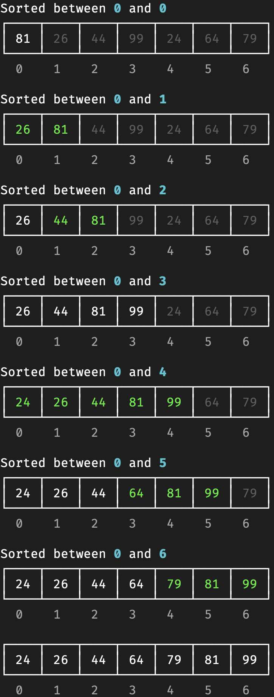
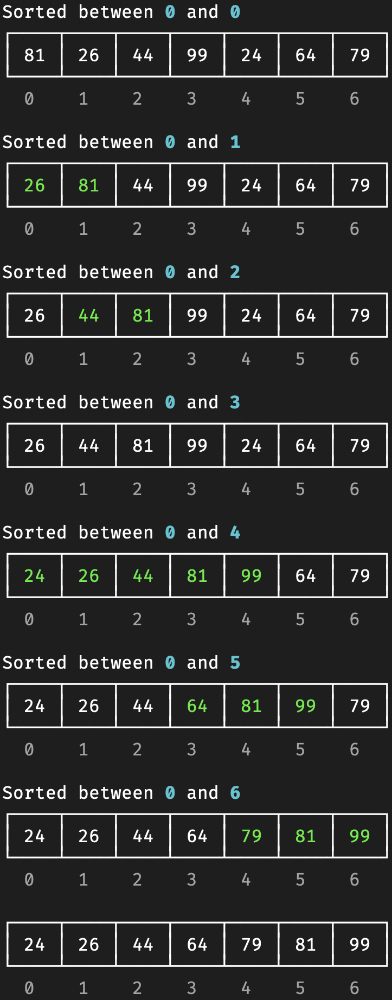
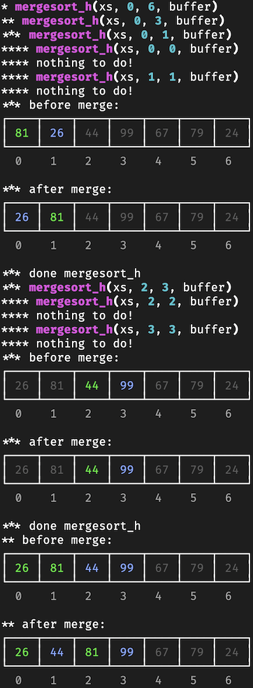
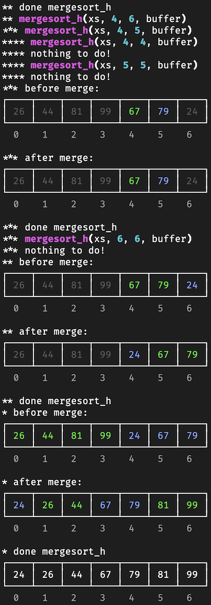

# tracelist

A drop-in list replacement that tracks and displays access and
modification using the rich library.

## Standard use

Since the `tracelist` sub-classes standard `list`, can be used to demo
list algorithms like sorting and searching without changing the source
code.

For example:

``` python
def insertion_sort(data: list):
    for i in range(len(data)):
        print(f"Sorted between {0} and {i}")
        j: int = i
        while j > 0 and data[j - 1] > data[j]:
            data[j - 1], data[j] = data[j], data[j - 1]
            j -= 1
        print(data)


data = tracelist([81, 26, 44, 99, 24, 64, 79])
data.read_color(None)
insertion_sort(data)
print(data)
```

will output:

<div class="center">



</div>

## Focusing

You can "focus" on a sub-list with any collection implementing
`__contains__`:

``` python
def insertion_sort(data):
    for i in range(len(data)):
        print(f"Sorted between {0} and {i}")
        data.focus(range(i+1))
        j: int = i
        while j > 0 and data[j - 1] > data[j]:
            data[j - 1], data[j] = data[j], data[j - 1]
            j -= 1
        print(data)
```

<div class="center">



</div>

## Mergesort

Here is trace of mergesort using the `tracelist`. It's required to set
colors in the algorithm to get the colors correct.

``` python
def merge(src: tracelist, low: int, mid: int, high: int, dst: tracelist):
    """Merge src[low:mid] with src[mid+1:high] into dst[low:high].mAssumes that src[low:mid] and src[mid+1:high] are individually sorted when this is called"""

    i: int = low
    j: int = mid + 1

    for k in range(low, high + 1):
        if i > mid:
            dst.write_color("cornflower_blue")
            dst[k] = src[j]
            j += 1
        elif j > high:
            dst.write_color("green3")
            dst[k] = src[i]
            i += 1
        elif src[i] < src[j]:
            dst.write_color("green3")
            dst[k] = src[i]
            i += 1
        else:
            dst.write_color("cornflower_blue")
            dst[k] = src[j]
            j += 1


def mergesort(xs: list[A]):
    buffer: list[A] = [None] * len(xs)
    mergesort_h(xs, 0, len(xs) - 1, buffer, 1)


def mergesort_h(xs: tracelist[A], low: int, high: int, buffer: tracelist[Optional[A]], depth):

    print(f"{'*' * depth} mergesort_h(xs, {low}, {high}, buffer)")

    if low >= high:
        print(f"{'*' * depth} nothing to do!")
        return

    # sort the two evenly divied subarrays 
    mid: int = (low + high) // 2
    mergesort_h(xs, low, mid, buffer, depth + 1)
    mergesort_h(xs, mid + 1, high, buffer, depth + 1)

    # copy the sub-arrays into the buffer
    xs.read_color("green3")
    for i in range(low, high + 1):
        if i == (low + high) // 2 + 1:
            xs.read_color("cornflower_blue")
        buffer[i] = xs[i]
    xs.read_color(None)

    xs.focus(range(low, high + 1))

    print(f"{'*' * depth} Before merge:")
    print(xs)

    # merge back into xs, so now xs[low:high] is now sorted
    merge(buffer, low, mid, high, xs)

    print(f"{'*' * depth} After merge:")
    print(xs)kk
    print(f"{'*' * depth} Done merge!")


data = tracelist([81, 26, 44, 99, 67, 79, 24], read_color=None)
mergesort(data)
print(data)
```

<div class="center">

|                             |                             |
|-----------------------------|-----------------------------|
|  |  |

</div>
